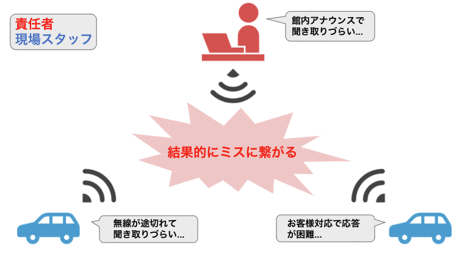
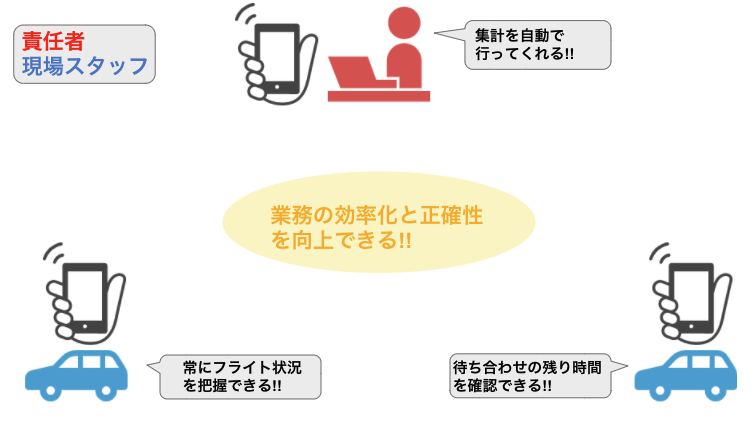

  

# アプリケーション名
Cart me!
 
 

# URL
- [ポートフォリオ](http://)
- [説明動画]()

 
 

# テスト用アカウント
予めフォーム内は入力済みに設定しております。  
- ユーザー名：cart
- パスワード：hasps

 
 

# アプリケーション概要
空港内の電動カート業務の効率化と正確性を向上を高めるWebアプリケーションです。  
リアルタイムにフライトや電動カートの予約状況などを視覚的に確認することができます。

 　
 

# 作成した目的
電動カート業務は、電動カートを運転する現場スタッフ２人と、責任者１人の計３人体制で  
業務を遂行し、業務中は無線機を使用して連携を図ます。しかしお客様の混雑状況や館内アナウンスによって、  
無線を聞き取ることが困難であったり、はたまた無線が途切れることに悩まされていました。  

  

そこでwebシステムで情報を共有することで、永続的に情報が保存されることでいつでも確認でき、  
また毎日行っていた手作業の集計を自動化することができると考えました。  
これにより、より正確な情報伝達を実現して問題を解決できると考え作成致しました。  

 

セキュリティの不安さから結果的に実務で使用することを実現することはできませんでしたが、  
Webシステムで様々な問題を解決していきたいと考えたきっかけを得ることができました。  

 
 

# アプリケーションでできること
## 電動カート関連
- ケア担当スタッフから受け付ける新規ご利用予約の登録
- 現場スタッフからお客様へのご利用のお声かけや、お客様からのご利用申請などによる予約無し利用の記録を投稿する
- お客様との待ち合わせ時間のタイムリミットを確認することができる
- １日のご利用集計を確認することができる
- 予約内容の変更、削除
- 過去のご利用履歴を確認することができる
## 情報共有
- フライト情報
    - フライトの運行状況（遅延や欠航など）を共有
- その他情報
    - 空港内における情報（お客様の混雑状況など）を共有

 
 

# 使用技術
- PHP7.2
- MySQL
- HTML5/CSS3
- Bootstrap4
- Apache
- Docker/Docker-compose
- AWS
    - VPC
    - EC2

 
 

# 機能一覧

- ログイン機能
- CRUD
    - Create
        - 電動カート新規予約
        - フライト情報投稿
        - その他情報投稿
    - Read
        - 予約一覧
        - 各種情報一覧
        - 過去の電動カートの利用履歴を日付検索式で表示
        - その日の電動カート利用の集計を表示
    - Update
        - 予約の編集
    - Delete
        - 予約の削除
        - 各種情報の自動削除
            - 日付をまたいだ情報は自動削除する
- タイムリミットを表示
    - 現在の時刻から予約の待ち合わせ時間までの残り時間を表示